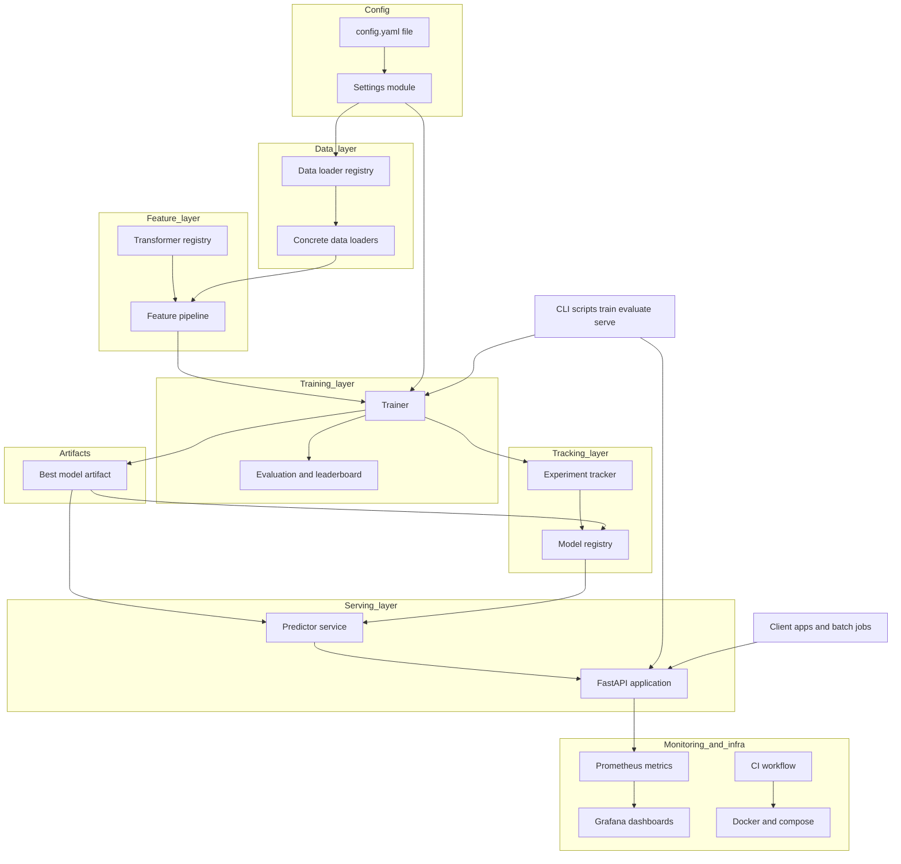

# HubSpot Prospect ML Framework

A small, opinionated template for building, evaluating, and serving **prospect conversion models**.

It’s meant to answer a simple question:

> “If I want to spin up a new tabular ML project for sales/marketing, how fast can I get from raw tables → features → experiments → API without rebuilding the same plumbing again?”

This repo gives you:

* A **config-driven workflow** so you can rerun experiments reliably.
* **Registries** for data loaders, feature transformers, and models, so adding new bits is trivial.
* A single **Trainer** that wires everything together.
* A **FastAPI** surface to serve the best model in production.
* CI, Docker, and monitoring stubs so it’s not just a notebook that “works on my machine.”

---

## Why this exists

### 1. Config-driven runs

All project behavior comes from a single YAML file: `config/config.yaml`.

`mlsys.config.Settings`:

* Loads this YAML.
* Validates it with Pydantic + `config/config.schema.json`.
* Exposes typed settings to data loaders, feature transformers, model selection, and serving defaults.

Every key can be overridden with an env var:

```bash
MLSYS_TRAINING__TEST_SIZE=0.25
MLSYS_SERVING__PORT=9000
```

…which makes experiments **reproducible** and **easy to share**: “Here’s the config and env overrides I used; you can rerun the same thing.”

See: `src/mlsys/config/settings.py`

---

### 2. Extensible registries

Most ML work is plugging in new sources / models without breaking everything else.

So:

* **Data loaders** live behind a registry (`csv`, `parquet`, `snowflake`, etc.).
* **Feature transformers** (fillna, categorical encoders, datetime features, aggregations) are also registered.
* **Models** (e.g., logistic regression, random forest, etc.) plug into a model registry.

Adding a new thing is intentionally boring:

* Create a small wrapper class.
* Register it next to the existing ones.

Example changes:

* New loader: add a `SnowflakeLoader` and register it in `src/mlsys/data/registry.py`.
* New model: wrap CatBoost or XGBoost and register it in `src/mlsys/models/registry.py`.
* New transformer: define it and add to `src/mlsys/features/transformer.py`.

---

### 3. One orchestration path

The **Trainer** is the main “brain”:

* Loads datasets via the configured loader.
* Builds the feature pipeline from the transformer list.
* Splits data into train/val/test.
* Runs cross-validated model selection over all configured models and param grids.
* Tracks metrics via the configured tracker (MLflow, W&B, or none).
* Saves the best model artifact + a leaderboard.

The CLI, tests, and API all run through this same path, so there isn’t a separate “throwaway script” vs “real pipeline.”

See: `src/mlsys/training/trainer.py`

---

### 4. Deployment-ready serving

`PredictorService` is the serving side of the same story:

* Can load:

  * A **local joblib bundle** (e.g., `models/best.joblib`), or
  * A model from **MLflow registry** (by name + stage).
* Exposes helpers for:

  * Predicting **one** prospect.
  * Predicting **batches** (e.g., CSV, list of dicts).

FastAPI routes call into this predictor and are wired in `src/mlsys/api/`.

Out of the box you get:

* OpenAPI docs at `/docs`.
* Prometheus middleware hooks for metrics.
* Docker assets to containerize the API.

Files to look at:

* `src/mlsys/serving/predictor.py`
* `scripts/serve.py`
* `docker/docker-compose.yml`

---

### 5. Tooling included

The repo ships with a “batteries included” setup:

* `pyproject.toml` — runtime + dev deps, plus config for:

  * `ruff` (lint)
  * `mypy` (types)
  * `pytest` (tests)
* `Makefile` — wraps common workflows (`install`, `train`, `serve`, etc.).
* `.github/workflows/ci.yml` — runs lint + tests on every push.

---

## Repository layout

```text
ml-sys/
├── README.md                  # this file
├── config/
│   ├── config.yaml            # main project config
│   └── config.schema.json     # JSON schema for validation
├── scripts/                   # train/evaluate/serve entrypoints
├── src/mlsys/                 # installable Python package
│   ├── api/                   # FastAPI app + routes
│   ├── data/                  # loaders + registry abstraction
│   ├── features/              # feature transformers + pipeline
│   ├── models/                # model registry + wrappers
│   ├── training/              # trainer, callbacks, eval helpers
│   ├── serving/               # model loader + predictor service
│   └── tracking/              # MLflow (and other) trackers
├── tests/                     # unit + integration tests
├── docker/                    # Dockerfile + docker-compose
└── monitoring/                # Prometheus + Grafana stubs
```

---

## Quick start

### 1. Set up the environment

Inside your virtualenv:

```bash
make install
```

This installs `mlsys` in editable mode with dev extras.

---

### 2. Prepare datasets

Drop your raw tables under `data/`:

* `customers` — current HubSpot customers.
* `noncustomers` — prospects that never converted.
* `usage_actions` — product usage / event data (optional but useful).

CSV, Parquet, or JSON are supported, depending on the loader you pick in config.

---

### 3. Configure the project

Edit `config/config.yaml` to:

* Point to the correct file paths.
* Set the ID + target columns.
* Choose feature transformers.
* Enable models and parameter grids.
* Configure experiment tracking and serving.

Sample config:

```yaml
project:
  name: hubspot-ml-framework
  version: "1.0.0"
  description: "Prospect conversion modeling sandbox"

data:
  loader_type: csv
  sources:
    customers: data/raw/customers.csv
    noncustomers: data/raw/noncustomers.csv
    usage_actions: data/raw/usage_actions.csv
  id_column: company_id
  target_column: is_customer

features:
  transformers:
    - type: fillna
      strategy: median
    - type: categorical
      columns: [EMPLOYEE_RANGE, INDUSTRY]
      encoding: onehot
    - type: datetime
      columns: [LAST_ACTIVE_AT]
      reference_date: "2024-12-31"

training:
  test_size: 0.2
  val_size: 0.1
  random_state: 42
  models:
    - name: logistic_baseline
      type: sklearn.logistic_regression
      param_grid:
        C: [0.1, 1.0, 10.0]
        penalty: ["l2"]
    - name: random_forest
      type: sklearn.random_forest
      param_grid:
        n_estimators: [200, 300]
        max_depth: [10, 20]

tracking:
  backend: mlflow
  tracking_uri: "file:./mlflow"
  experiment_name: hubspot_conversion
  run_name_prefix: leadscore
  registry:
    model_name: hubspot_conversion_model
    stage: Production

serving:
  host: 0.0.0.0
  port: 8000
  model_name: hubspot_conversion_model
  model_stage: Production
  local_model_path: models/best.joblib
```

Notes:

* The `features.transformers` list is applied **in order**.
* `training.models` defines which models to try and their param grids.
* `tracking` lets you pick `mlflow`, `wandb`, or `none`.
* `serving.local_model_path` can be empty if you always want to fetch from MLflow.

---

### 4. Train models

```bash
make train               # uses config/config.yaml
make train NO_TRACKING=1 # same, but without MLflow
```

The training script:

* Builds and runs the full pipeline.
* Prints a **leaderboard** of models + metrics.
* Persists the **best artifact**.
* If tracking is enabled, logs metrics/params/artifacts to MLflow.

---

### 5. Evaluate

```bash
make evaluate
```

The evaluator:

* Loads the held-out set.
* Computes metrics for the best model.
* Is set up so you can easily extend it to add **business KPIs** (e.g., lift in conversion for top-N scored leads).

---

### 6. Serve the model

```bash
make serve
```

Then open:

* `http://localhost:8000/docs` — interactive Swagger UI.
* Try a `POST /predict` with a single prospect or a small batch.

The API uses the same `PredictorService` that batch jobs can use to score CSVs.

---

### 7. Quality gates

```bash
make lint      # Ruff
make typecheck # mypy
make test      # pytest
```

---

### 8. Containers & monitoring (optional)

```bash
make docker-build
make up           # docker-compose up with API + MLflow + Prometheus/Grafana
make logs         # tail service logs
make down         # tear everything down
```

`monitoring/` has starter configs for Prometheus + Grafana, so you can track latency, error rates, and QPS once this is running in a real environment.

---

## Configuration cheat sheet

* **project**
  Human-readable metadata. Shows up in logs, MLflow tags, and slide decks.

* **data**

  * `loader_type`: which loader to use (`csv`, etc.).
  * `sources`: map of dataset names → file paths.
  * Special names like `customers`, `noncustomers`, and `usage_actions` get special handling in `FeaturePipeline`.

* **features.transformers**
  Ordered list of feature transformers, e.g.:

  * `fillna` — missing value handling.
  * `categorical` — encodings (one-hot, etc.).
  * `datetime` — extract time-based features given a reference date.
  * `aggregation` — rollups over usage actions.

  You can extend this by adding your own transformer and registering it.

* **training**

  * `test_size`, `val_size`, `random_state`.
  * `models`: which algorithms to run and their param grids.

  Under the hood, the Trainer uses stratified K-fold CV, tracks metrics with the configured tracker, and stores leaderboard comparisons.

* **tracking**

  * `backend`: `mlflow`, `wandb`, or `none`.
  * `tracking_uri`, `experiment_name`, `run_name_prefix`.
  * Optional registry settings for model name + stage.

* **serving**

  * Host/port for FastAPI.
  * Model name + stage for registry-based serving.
  * `local_model_path` for offline scenarios.

---

## How to present this in an interview

Rough storyline:

1. **Start with the problem.**
   Sales teams need good **lead scoring / prospect models**, but:

   * Data scientists shouldn’t rebuild infra every time.
   * You want fast iteration + safe deployment.

2. **Show the workflow.**

   * Point to `config/config.yaml`.
   * Show how an analyst can change:

     * Which features are enabled.
     * Which models / grids are tried.
     * Splits and seeds.
   * No code changes, just config.

3. **Walk through training.**

   * Run `make train`.
   * Highlight:

     * Dataset loading.
     * Feature pipeline.
     * Model search.
     * Leaderboard + artifact.

4. **Demo serving.**

   * Run `make serve`.
   * Open `/docs`.
   * Send a fake prospect through `/predict`.
   * Explain how the same `PredictorService` can do batch scoring.

5. **Close with future work.**

   * Mention leakage checks, better feature stores, drift monitoring, richer model metadata, etc.
   * Point at `docs/improvement-plan.md` (if present) to show you’ve already thought about it.

---

## Getting unstuck

A few tips if you’re poking around:

* Validate config:

  ```bash
  python -m jsonschema -i config/config.yaml config/config.schema.json
  ```

* See what transformers/models exist:

  ```python
  from mlsys.features import TransformerRegistry
  from mlsys.models import ModelRegistry

  print(TransformerRegistry.list())
  print(ModelRegistry.list())
  ```

* Use `tests/` as examples of the public APIs.

* `notebooks/` mirror the production pipeline for exploratory work / storytelling.

---

## Mermaid diagram

Here’s a high-level view of the offline (training) and online (serving) flow:


